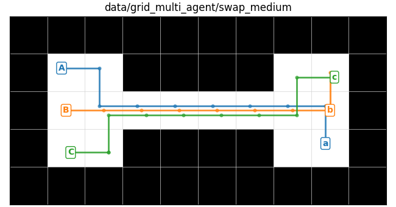
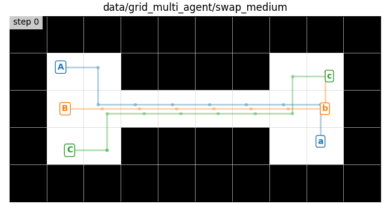
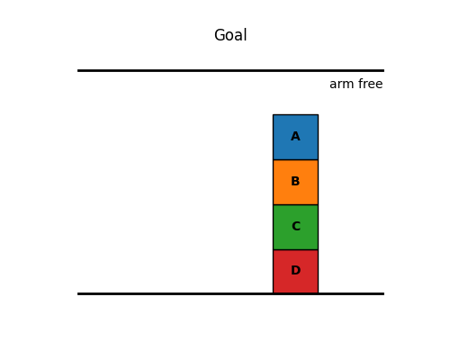
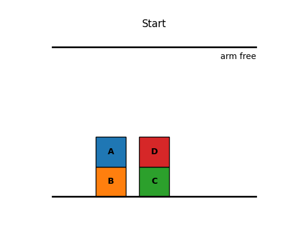
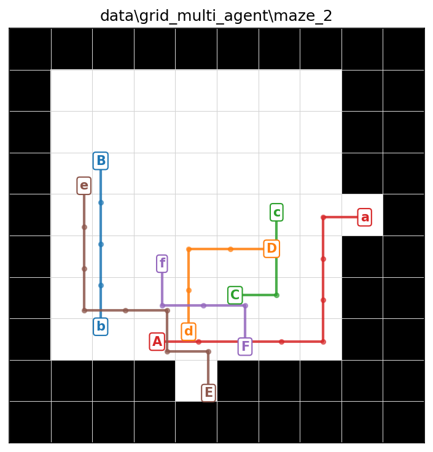

# CS440 Online Fall 2026, MP 2: Multi Agent Path Finding and Task Planning
## Due: Sunday, September 20, 2026, 11:59 PM CST

## I. Overview

In this assignment you will be implementing a coupled state space for multi agent path finding (MAPF) and a boolean predicate state space for task planning (TP) in a block world. You will then implement the approach of your choosing for fast MAPF on hard instances. You will be solving search problems in these spaces using the same best_first_search implementation you used for MP1.

## II. Getting Started 

To get started on this assignment look inside the template/ directory. The template contains the following files and directories:

* `search.py`. You will edit and submit this - you should copy over your code from MP1's `search.py`
* `state.py`. You will edit and submit this - you should copy over your code from MP1's `AbstractState` class (namely the implementation of the `__lt__(self, other)` function)
* `mapf.py`. You will edit and submit this - your `MultiAgentGridState` class goes here
* `hard_mapf.py`. You will edit and submit this - your fast solver for hard MAPF instances goes here
* `task_planning.py`. You will edit and submit this - your `BlockWorld` actions and `BooleanPredicatesState` class go here

* `main.py`. Main entry point for this assignment, you will be running this main file to test your code
* `maze.py`. Some utilities we provide for working with Mazes, unchanged from MP1, except for visualization
* `tp_vis.py`. Some utilities we provide for visualizing the task planning block world state space

* `requirements.txt`. You can install the required packages with `pip install -r requirements.txt`, unchanged from MP1
* `data/grid_multi_agent`. Text files containing example problems for multi agent grid state 
* `data/block_world`. JSON files containing example problems for block world

Please ONLY submit `search.py`, `state.py`, `mapf.py`, `hard_mapf.py`, and `task_planning.py`.

For each of the remaining parts of the assignment you will find TODOs in one of these five files where you need to write your own code. For example, for part III you will find TODOs marked `# TODO(III)`. We've provided many comments and instructions in the code under those TODOs.

*Please be aware: our visualization code is not bulletproof. It does not check for correct types and return values, this is your responsibility. If your methods return the wrong types, such as failing to find a path when one exists, then the visualization may throw unexpected errors. In general if you are getting errors from our visualization code you should probably first do some debugging with print statements...*

## III. Copy Code from MP1

There is 1 `TODO(III)` in each of `search.py`, `state.py`, and `mapf.py`.

You need to copy over your `best_first_search`, `backtrack`, `manhattan`, and `__lt__` (in `AbstractState`) methods from MP1. If you did not finish these when doing MP1 you should go back and make sure you pass all the initial tests for MP1 which examined these functions (you should pass all tests related to "TODO(III)"'s in MP1), though we do provide some zero-point tests for this part on Gradescope.

## IV. MultiAgentGridState

<figure align="center">
    
    
    <figcaption align = "center"><b>A solved multi-agent path finding instance, shown as a static path visualization and as an animation. Capital letters are agent starts and matching lowercase letters are their goals. Each agent follows its own colored track; small offsets are just to make overlapping paths easier to read. Unlike MP1 now agents can wait in place, which you can see in the animation.</b></figcaption>
</figure>

We now implement a grid state class to include multiple agents, each of which has a single goal. A `MultiAgentGridState.state` is a tuple of agent locations, for example `((1, 3), (4, 5))` for two agents. The matching `goal` is also a tuple, where `goal[i]` is the destination for `state[i]`. The order of agents must stay fixed throughout the search. The set of neighbors of a state are the set of all possible joint actions that can be taken by the agents. Notice that now, by default, the maze also allows waiting in place, meaning an agent may choose to remain in its current cell for one time step. The cost of one joint action is $1$, no matter how many agents move or wait in place, and therefore the path length measures the number of time steps until all agents have reached their goals - the makespan.

In `get_neighbors` you must reject two kinds of inter-agent collision:

* Vertex collision: two agents try to occupy the same cell at the same time
* Edge-swap collision: two agents try to swap cells in the same time step

For example, the following scenario is an invalid edge-swap collision: agent 0 moves from cell `x=(i, j)` to `y=(k, l)` while agent 1 moves from cell `y=(k, l)` to `x=(i, j)`. In other words, `self.state[0] = x, self.state[1] = y, new_state[0] = y, new_state[1] = x`.

Besides `get_neighbors`, there are 3 more `TODO(IV)` for you to complete in `mapf.py`: `is_goal` and two heuristic functions. `is_goal` should return True when all agents are at their goals. The two heuristic functions are the max and sum of the Manhattan distances from each agent to its goal. The max heuristic is admissible, while the sum heuristic is inadmissible. You may also implement your own better heuristics if you wish to experiment but notice that the autograder compares both path quality and number of explored states for the coupled MAPF cases.

Run best_first_search on a coupled MAPF problem:
```
python3 main.py --problem_type=GridMultiAgent --use_heuristic --maze_file=data/grid_multi_agent/swap_small
```

You can replace `data/grid_multi_agent/swap_small` with another maze file in `data/grid_multi_agent`. The `--heuristic_type` flag can be set to `admissible` or `inadmissible`; it defaults to `admissible` for grid problems. If you'd like to see the effect of disallowing waiting you can add the `--disallow_waiting` flag, whose default value is False. If you would like to also visualize the resulting solution with matplotlib add the `--show_maze_vis` flag, or save the static visualization with `--save_maze=some_file.png`. To animate the solution, add `--animate_maze`. Notice some of the mazes we've provided are too hard for coupled MAPF - we will deal with those in part VII of this assignment.

## V. BlockWorld

<figure align="center">
    
    
    
    <figcaption align = "center"><b>We now implement task planning for stacking blocks using an AbstractState space to represent Boolean predicates. Our implementation can accommodate any number of blocks and we will use the same best first search implementation along with two kinds of heuristics. In the case of the visualization above the goal conditions are {"A_is_on_B", "B_is_on_C", "C_is_on_D"} and the shortest plan has 10 actions, or 11 states including the start. While the starting state is a full specification of the set of true facts, the goal condition is just a subset (notice how "A_is_on_top" is True here but not specified). In the animation, the title shows the action that produced each new state.</b></figcaption>
</figure>

We now implement a task planning state space for stacking blocks. The state should consist of a set of facts about the world, and actions require certain facts as preconditions and have some effect on the set of facts. Both facts and actions will be represented as functions which take as input zero or more objects (in our case the only object type is "block").

We are going to separate our code into two classes, a `World` class, which captures the predicates, actions, and objects that together make up our state space, and a `BooleanPredicatesState` class, which captures the current set of true facts about the world. Think of the `World` like the `Maze` from the MAPF problems and `BooleanPredicatesState` as the `GridState`. We've provided you most of the code related to defining the `World` and specifically the `BlockWorld` classes. You just need to fill in the 4 `TODO(V)` in `task_planning.py` for the 4 actions in this space.

Each action is a static function that returns `(preconditions, postconditions)`.

* `preconditions` is a set of facts that must already be true to take the action
* `postconditions` is a dictionary with two keys:
  * `"delete"` maps to facts that become false after the action
  * `"add"` maps to facts that become true after the action

All preconditions and postconditions should be built from the predicate helpers already defined in `BlockWorld`, such as `BlockWorld.holding(block)` or `BlockWorld.block_on_block(blockA, blockB)`. For example, a precondition for `place(block)` is `BlockWorld.holding(block)`.

## VI. BooleanPredicatesState

We now move on to `BooleanPredicatesState`. There are 5 `TODO(VI)` in `task_planning.py`.

The first is `take_action(preconditions, postconditions)` which should be called with the preconditions and postconditions for a specific action. This function will be used to compute the set of facts that result from applying the action to the current state. It should:

* return `None` if the action's preconditions are not all contained in `self.state`,
* otherwise return a new set of facts after applying the action,
* add every fact in `postconditions["add"]`,
* remove every fact in `postconditions["delete"]` unless `self.delete_relaxation` is True,
* never modify `self.state` in place

The next TODO is `get_neighbors`. To generate neighbors, loop over every action in `self.world.actions`, ground that action with every possible tuple of object inputs, call `take_action`, and create a neighboring `BooleanPredicatesState` whenever the action is valid. The object types for each action are stored in `self.world.action_inputs`, and the available objects of each type are stored in `self.world.objects_by_type`. Similar to iterating over all possible combinations of agent actions in the Coupled MAPF part, to implement this grounding step you may find `itertools.product` useful.

For the final TODOs, implement `is_goal` to return True when all goal facts are present in `self.state`. The goal is a subset condition, not an exact match. Then implement the two heuristics:

* `compute_num_unsatisfied_goals_heuristic`: return the number of goal facts not currently present in `self.state`
* `compute_delete_relaxation_heuristic`: solve the relaxed problem from the current state, where delete postconditions are ignored, and return the length of that relaxed plan

For the delete-relaxation heuristic, you can create a new `BooleanPredicatesState` with the same facts and goal but with `delete_relaxation=True`, then run `best_first_search` on that relaxed state. Notice how we do **search** in order to compute this heuristic but it is for an easier version of the problem.

To run best_first_search on the provided BlockWorld problem:
```
python3 main.py --problem_type=BlockWorld --block_file=data/block_world/block_world_1.json
```

You can replace `data/block_world/block_world_1.json` with any other BlockWorld JSON file you create. Note that we have not provided you with many test cases in `data/block_world/`, you may want to write your own. Make sure to follow the same template. When running main, add `--use_heuristic` to use the heuristic selected by `--heuristic_type`. The `--heuristic_type` flag can be set to `num_unsatisfied_goals` or `delete_relaxation`; it defaults to `num_unsatisfied_goals` for BlockWorld. The `--spf=1.0` flag sets the seconds per frame for the visualization of the final path to $1.0$ seconds per frame. If you set `--spf=0` or any negative number you will not see the visualization of the final path.

Note that some of our tests look at the number of states you explore during search. If you'd like to debug this quantity you can look at `maze.num_states_validated` or you can also print out `len(visited_states)` from your `best_first_search` implementation to see a related but slightly different quantity (make sure to remove such print statements before submitting). You should expect fewer explored states for better heuristics...

## VII. Fast MAPF

We wrap up this assignment by going back to MAPF. There are some problems in `data/grid_multi_agent` that are too difficult for coupled MAPF to solve, namely they will take a very long time. In `hard_mapf.py` you will find a single `TODO(VII)` to implement the `solve_hard_mapf_instance` method in the manner of your choosing. To get full credit you need to solve all 5 hard instances (mazes 2 through 6) in less than 20 seconds each on Gradescope.

Again, your implementation (whether CBS or PBS or Prioritized Search or something else, whether using your implementation of `best_first_search` or not, etc.) is your choice. You will be graded on the *speed and correctness* of your solution but not the *path length or optimality*.

`solve_hard_mapf_instance(starts, goals, maze)` should return a list of paths, one path per agent:

```
[
    [(r0, c0), (r1, c1), ...],  # path for agent 0
    [(r0, c0), (r1, c1), ...],  # path for agent 1
    ...
]
```

The number of returned paths must equal `len(starts)`. For each agent `i`, `paths[i][0]` must equal `starts[i]`, and `paths[i][-1]` must equal `goals[i]`. Paths may have different lengths; after an agent reaches its goal, the autograder treats that agent as waiting at its final cell but that doesn't mean this agent disappears! One common bug is ignoring an agent after it reaches its goal. The full set of paths must avoid walls, invalid moves, vertex collisions, and edge-swap collisions. These edge-swap collisions are often difficult to see in either a static image or a fast moving animation; we highly recommend writing your own tester to check for such collisions in a returned path.

<figure align="center">
    
    <figcaption align = "center"><b>A hard MAPF instance solved by a faster, not-necessarily-optimal method. For Part VII, correctness and runtime matter; optimality does not.</b></figcaption>
</figure>

Run your hard MAPF solver on one of the hard mazes:
```
python3 main.py --problem_type=GridHard --maze_file=data/grid_multi_agent/maze_2
```

You can replace `data/grid_multi_agent/maze_2` with any maze file in `data/grid_multi_agent`. Notice that parameters like `--heuristic_type` and `--use_heuristic` are not used for `GridHard`; your `solve_hard_mapf_instance` function decides how to solve the problem.

## Submission Instructions

Submit the main part of this assignment by uploading `search.py`, `state.py`, `mapf.py`, `hard_mapf.py`, and `task_planning.py` to Gradescope. Do not forget to access Gradescope from the Launch App button in Coursera so that your grade is automatically sync'd.

Before submitting, make sure to comment out any print statements you added for debugging, since extra output can slow down your code on the autograder.

## Policies

You are expected to be familiar with the general policies on the course syllabus (e.g. academic integrity). In particular, notice that this is an individual assignment and that you may not use external sources to write significant parts of your code for you.
